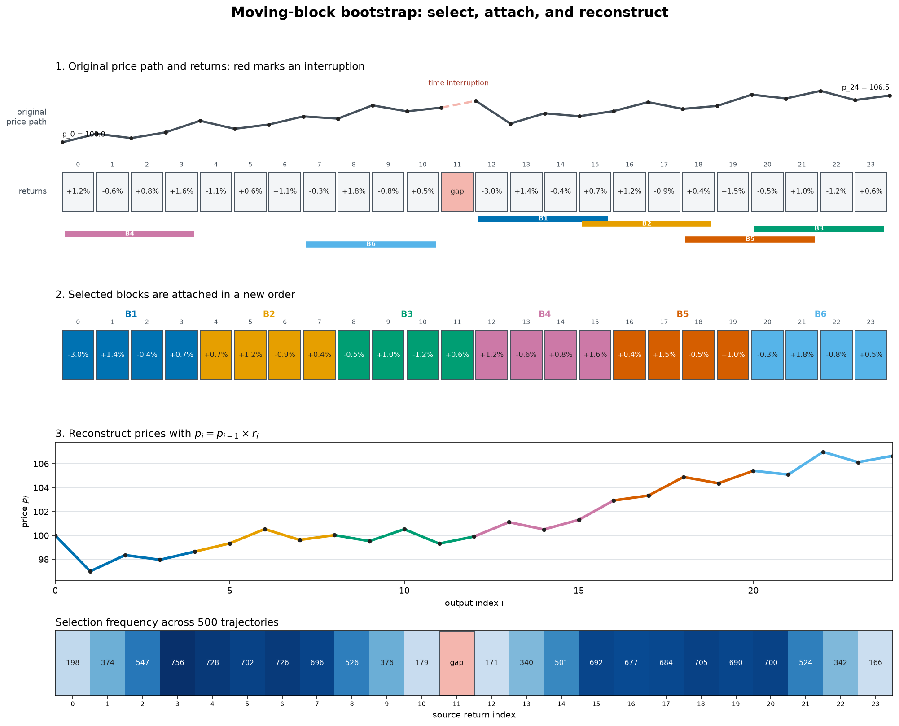
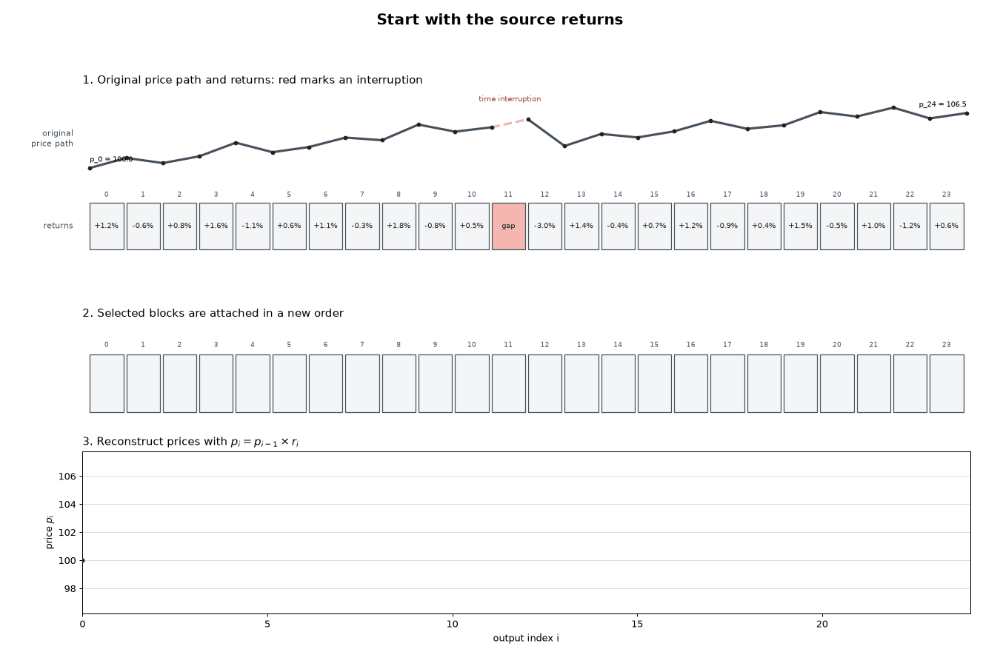

# Minisim moving-block bootstrap

`bootstrap.py` reads one-minute Binance candles, transforms close prices into
multiplicative returns, samples uninterrupted day- or week-sized blocks, and
writes Minisim `[time, price, volume]` trajectories.



The top panel aligns the original price path with its close-to-close returns.
Colors identify sampled blocks throughout selection, attachment, and price
reconstruction. The red return crosses a time interruption, so no candidate
block may contain it. The heatmap counts how often each source return is
selected across 500 generated trajectories.



## Setup

Create the Python environment:

```bash
python3 -m venv .venv
source .venv/bin/activate
python -m pip install -r requirements.txt
```

Fetch and build the pinned Minisim version:

```bash
./scripts/fetch_minisim.sh
```

The setup script uses a partial, sparse checkout of
[`Shimuuar/cryptopool-simulator`](https://github.com/Shimuuar/cryptopool-simulator)
and materializes its `minisim/` directory plus the shared `json.hpp` header
that Minisim includes. The legacy simulator and experiment directories are not
checked out. The dependency and compiled files remain under `.deps/`, outside
this repository's history. The Minisim binary is written to:

```text
.deps/cryptopool-simulator/minisim/minisim
```

## Generate trajectories

```bash
python bootstrap.py CANDLES.json OUTPUT_DIR BLOCK_LENGTH TRAJECTORIES [SEED]
```

For example, generate 100 trajectories from two-week blocks with seed 17:

```bash
python bootstrap.py btc2023.json trajectories 2w 100 17
```

`BLOCK_LENGTH` uses `d` for days or `w` for weeks. For example, `7d` samples
seven-day blocks and `2w` samples two-week blocks. Large contiguous blocks
preserve the volatility dependence within each sampled period. The optional
random seed defaults to `0`.

Each run also writes `selection_heatmap.png` in the output directory. Its rows
are generated trajectories, its columns are source days or weeks, and its color
records how many returns were selected from each source period. Red vertical
lines mark time interruptions that sampled blocks cannot cross.

## Regenerate the explanatory figures

```bash
python visualize_bootstrap.py
```
